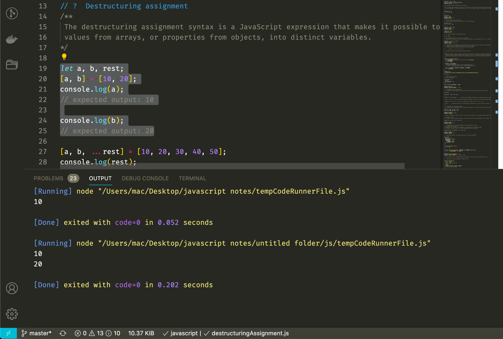

# javascript-notes
javascript samples and code notes

# My JavaScript notes in one place.

### Recommendations:

- Visual Studio Code
- Better Comments   [ VS Code Extension ] 
- Code Runner       [ VS Code Extension ] 

## Codes

  
### Sample Usage

- With Code Runner [VS Code Extension], you can easily run only selected codes.
- Run Code
 

  

- Output of codes in the selected area
 

